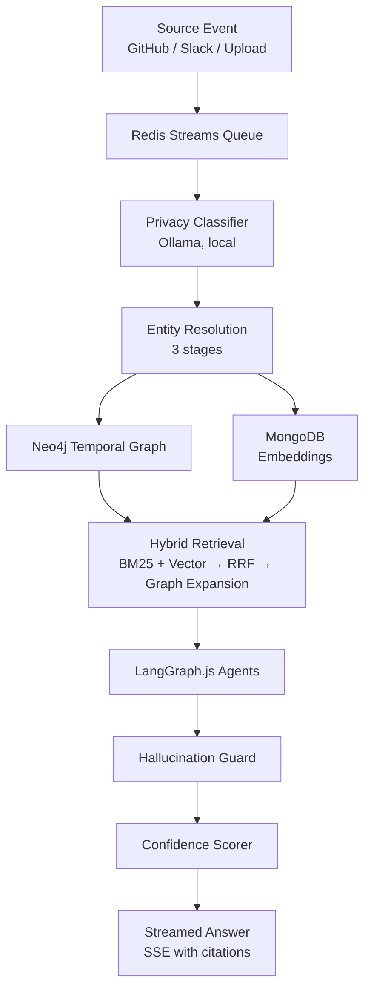

# OmniRAG
### Organizational Memory Operating System

A temporal knowledge graph that connects GitHub activity, Slack messages, and uploaded documents into a single queryable layer — one that understands not just *what* is true, but *what was true when*, and *why it changed*.

---

## The Problem

Knowledge dies quietly inside teams and study groups. A decision made in a Slack thread six months ago. An architectural choice explained in a doc nobody saved. A bug fixed by someone who's since moved on. None of it is "lost" exactly — it's just buried, and finding it again costs more time than it would have taken to redo the work.

Tools like Notion, Confluence, and Google Drive store knowledge, but require humans to organize and tag it — which rarely happens consistently. Standard RAG over documents retrieves *similar text*, but can't answer questions like *"why did we move away from PostgreSQL?"* or *"has this decision been reversed since?"*

OmniRAG is built to close that gap — automatically connecting knowledge across sources, tracking how it changes over time, and answering questions with citations and honest confidence scores.

## Status

🚧 **In development.** Core components — ingestion, entity resolution, the temporal graph layer, and hybrid retrieval — are implemented as individual modules. End-to-end pipeline integration is in progress. See [Component Status](#component-status) below for what's currently working.

## How It Works

**1. Ingestion**
GitHub webhooks, Slack events, and uploaded files (PDF/DOCX) flow into a Redis Streams queue. Events are validated and acknowledged in under 50ms, then processed asynchronously — so the API never blocks on slow downstream work.

**2. Entity Resolution**
The same person or concept often appears under different names across sources — `ps2024` on GitHub, `Priya Sharma` on Slack, `priya.sharma@company.com` in a document. A three-stage pipeline resolves these:

- **Stage 1 — Jaro-Winkler** (lexical similarity, catches name variants)
- **Stage 2 — Embedding cosine similarity** (Transformers.js, all-MiniLM-L6-v2, catches semantic aliases)
- **Stage 3 — Graph neighborhood** (shared connections in Neo4j — catches identity links with zero lexical or semantic overlap)

Every merge is recorded as a reversible graph event. The pipeline is validated against a 200-pair adversarial test set — pairs of similar-but-different names that *must not* be merged — targeting a false-merge rate under 2%.

**3. Temporal Knowledge Graph**
Every node and relationship in Neo4j carries `valid_from` / `valid_until` timestamps. When a decision is reversed, the old node isn't deleted — it's marked invalid from that point forward, and a new node takes over with a `SUPERSEDES` link back. This means you can query *"what did we believe in 2022?"* and get a correct answer, without ever storing a full graph snapshot.

**4. Hybrid Retrieval**
Two retrieval methods run in parallel — BM25 full-text search (good for exact terms, error codes, names) and vector similarity search (good for conceptual queries) — and are fused via Reciprocal Rank Fusion. The top results are then expanded 1-2 hops through the graph, surfacing causally connected information that neither method would find alone.

**5. Agent Pipeline & Safety**
A LangGraph.js coordinator routes queries to specialist agents (Graph Traversal, Causal Inference, Synthesis) based on query type. Before any answer reaches the user, a deterministic **hallucination guard** checks every factual claim against the retrieved source nodes — anything unsupported is stripped, not flagged. Confidence scores are derived from graph properties (source count, recency, contradictions, verification status) rather than the LLM's self-reported confidence, which research has repeatedly shown to be unreliable.

## Architecture


## Tech Stack

| Layer | Technology | Why |
|---|---|---|
| Runtime | Node.js 20 + TypeScript | Async I/O suits webhook-heavy ingestion; types catch graph schema errors at compile time |
| Graph DB | Neo4j | Multi-hop traversal is O(1) per hop — recursive queries in a relational DB get exponentially slower |
| Document/Vector store | MongoDB Atlas Vector Search | Heterogeneous source schemas + vector search in one service |
| Queue/Cache | Redis Streams | Ordered, replayable, acknowledged ingestion processing |
| Embeddings | Transformers.js (all-MiniLM-L6-v2) | Runs in-process — no API cost, no network latency, works offline |
| Agent orchestration | LangGraph.js | Coordinator can branch dynamically based on query type and intermediate results |
| LLM | Groq (LLaMA 3.1), Ollama fallback | High throughput for multi-step reasoning chains; local fallback for privacy-sensitive classification |
| Frontend | React + TypeScript + Tailwind + react-force-graph | Force-directed graph visualization with a temporal slider |

## Component Status

| Component | Status |
|---|---|
| GitHub / Slack / file ingestion | In progress |
| Three-stage entity resolution | In progress |
| Temporal graph writes (Neo4j) | In progress |
| Hybrid retrieval (BM25 + vector + RRF) | In progress |
| Hallucination guard & confidence scoring | In progress |
| LangGraph.js agent coordinator | In progress |
| Knowledge Transfer Documents, drift detection, expert routing | Planned |
| Frontend visualization (temporal graph view) | Planned |

## Local Setup

```bash
git clone https://github.com/shagunbhadouria/omnirag && cd omnirag
cp .env.example .env   # add your API keys — see .env.example for required values
docker-compose up
```

Requires Docker. See `.env.example` for required environment variables (MongoDB, Neo4j, Groq, Google OAuth).

## Design Documentation

Full design rationale — schema decisions, API contracts, evaluation methodology — lives in `/docs`.
